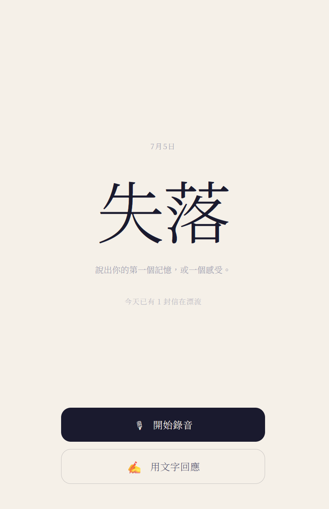
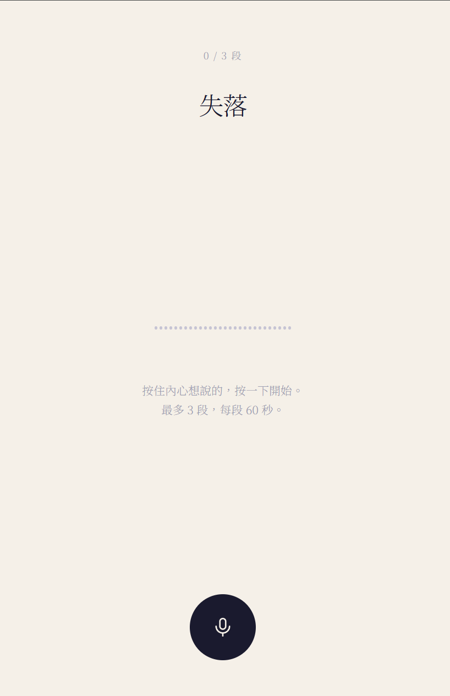

# DriftWord 漂流詞

> 每天一個詞。說出你的第一個記憶，或一個感受。
> 你的話會漂流給一個陌生人，你也會收到另一個陌生人的回應。
> 沒有按讚，沒有追蹤，只有這一次交換。

---

## ▶ 開始使用

### 🌊 [https://drift-word.vercel.app](https://drift-word.vercel.app)

打開網頁 → 看見今天的詞 → 用語音或文字說出你的感受 → 收到一封陌生人的信。
不需要註冊，不需要帳號。

---

## 這是什麼

DriftWord 不是社群 app，是一種**儀式**。

- **每天一個詞**（例如「消失」「等待」「遺囑」），由 300 字的詞庫每天 00:00 自動更換。
- 你用**語音**（最多 3 段，每段 60 秒）或**文字**，說出對這個詞的第一個記憶或感受。
- 送出後，你的回應**漂流給一個陌生人**；同時你會**收到另一個陌生人**對同一個詞的回應。
- **一天只交換一次。** 沒有讚、沒有回覆、沒有追蹤——你們不會再相遇。

收到回應的那一刻，像是打開一封不知從哪裡來的信。

---

## 畫面截圖

<p align="center">
  
  
  
</p>

---

## 功能

- 🎙 **語音回應**：瀏覽器原生錄音，最多 3 段、每段 60 秒，逐段試聽與重錄
- ✍️ **文字回應**：手寫感的書寫頁面
- 🔁 **漂流配對**：送出即與一位陌生人交換；若當下無人可配，頁面會靜靜等著，有信漂入時自動浮現，不需重整
- 📨 **拆信式收件**：語音以波形播放、文字以手寫信紙呈現，不顯示對方任何個資
- 📅 **每日換詞**：詞庫 + Postgres cron，台北時間每天 00:00 自動輪換
- 🙈 **免註冊**：匿名身分，一天一次（資料庫層鎖定）
- 🛡️ **內容審查**：文字經關鍵字黑名單 + OpenAI Moderation 雙重過濾；語音經 Groq Whisper 轉文字後同樣送審，API key 不暴露前端

---

## 技術棧

| 層 | 技術 |
|----|------|
| 前端 | React + Vite + Tailwind CSS |
| 後端 | Supabase（Auth 匿名登入 / Postgres / Storage） |
| 語音 | 瀏覽器原生 MediaRecorder API |
| 排程 | Supabase pg_cron（每日換詞） |
| 內容審查 | OpenAI Moderation（文字）+ Groq Whisper（語音轉文字）|
| 部署 | Vercel |

---

## 本地開發

```bash
# 1. 取得程式碼
git clone https://github.com/frankkn/DriftWord.git
cd DriftWord

# 2. 安裝依賴
npm install

# 3. 設定環境變數
cp .env.example .env.local
# 編輯 .env.local，填入你的 Supabase 專案 URL 與 publishable key

# 4. 啟動
npm run dev
# 開啟 http://localhost:5173
```

### 環境變數

| 變數 | 說明 |
|------|------|
| `VITE_SUPABASE_URL` | Supabase 專案 URL（如 `https://xxxx.supabase.co`） |
| `VITE_SUPABASE_KEY` | Supabase publishable key（可公開放前端） |

---

## Supabase 設定

在 Supabase 後台依序執行 `supabase/` 下的 SQL：

1. **`schema.sql`** — 建立 `word_bank` / `drifts` / `drift_segments` 三表、RLS 權限、配對 RPC、唯一約束
2. **`words.sql`** — 種入 300 個詞、每日換詞函式、pg_cron 排程
3. **`storage.sql`** — 建立私有 `drifts` bucket 與上傳/讀取政策

另外，到 **Authentication → Sign In / Providers** 開啟 **Anonymous sign-ins**。

### Edge Functions

在 **Edge Functions → Secrets** 新增以下兩組 secret：

| Secret | 說明 |
|--------|------|
| `OPENAI_API_KEY` | OpenAI API key，用於文字與語音的 Moderation |
| `GROQ_API_KEY` | Groq API key，用於語音轉文字（Whisper Large v3 Turbo） |

部署兩個 function：

```bash
npx supabase functions deploy moderate-text --project-ref <your-project-ref>
npx supabase functions deploy moderate-voice --project-ref <your-project-ref>
```

或直接在 Supabase Dashboard → Edge Functions 手動建立並貼入 `supabase/functions/` 下對應的程式碼。

---

## 測試資料

本地測試「收到陌生人回應」時，資料庫需要有別人留下的、未認領的回應：

```bash
node scripts/seed-test-drifts.mjs           # 種 5 則文字 + 1 則語音
node scripts/seed-test-drifts.mjs 8         # 自訂數量
node scripts/seed-test-drifts.mjs --verify  # 種完後認領一則確認循環可通
```

---

## 專案結構

```
src/
  App.jsx                  首頁與狀態流轉
  components/
    RecordingScreen.jsx    錄音頁
    TextScreen.jsx         文字書寫頁
    ReceivedScreen.jsx     拆信式收件頁
    LetterAudio.jsx        波形語音播放器
    TodayClosed.jsx        今天已回應的首頁狀態
    SettingsScreen.jsx     設定頁
    ConfirmDrift.jsx       送出前的確認層
  hooks/
    useRecorder.js         MediaRecorder 錄音邏輯
  lib/
    supabase.js            Supabase client
    session.js             匿名身分
    words.js               今日詞
    drift.js               送出、配對、收件、等待時自動輪詢
    messages.js            詩意錯誤文案
supabase/
  schema.sql / words.sql / storage.sql
  functions/
    moderate-text/           文字內容審查（OpenAI Moderation）
    moderate-voice/          語音轉文字 + 審查（Groq Whisper + OpenAI）
scripts/
  seed-test-drifts.mjs     測試資料種子
```

---

## 設計

接近紙張的米白底、墨水感深色文字、收斂的暗藍紫主題色。中文內文採 Noto Serif TC，手寫信件用 Ma Shan Zheng。極簡、沉浸、帶點詩意——讓每一次交換像翻開同一頁日記。
