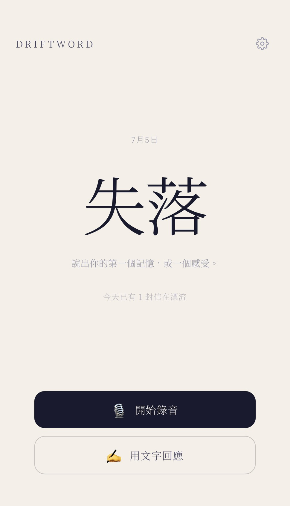
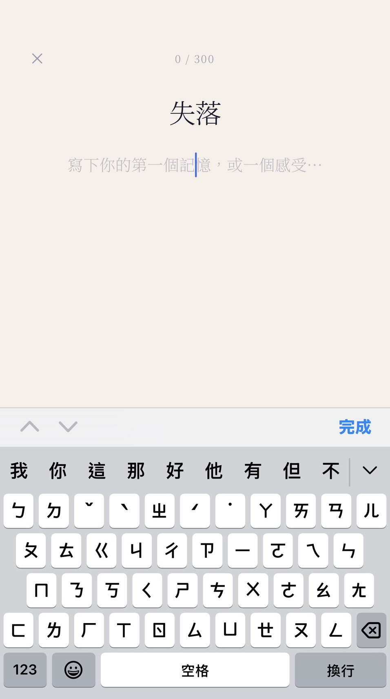
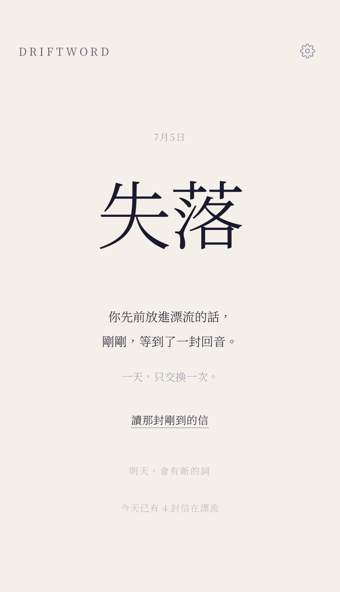
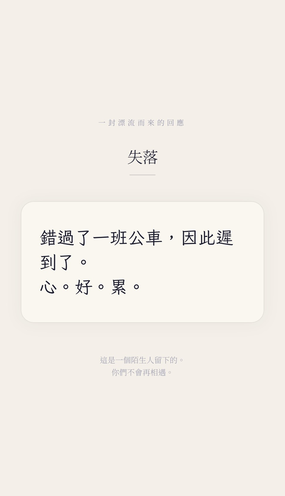
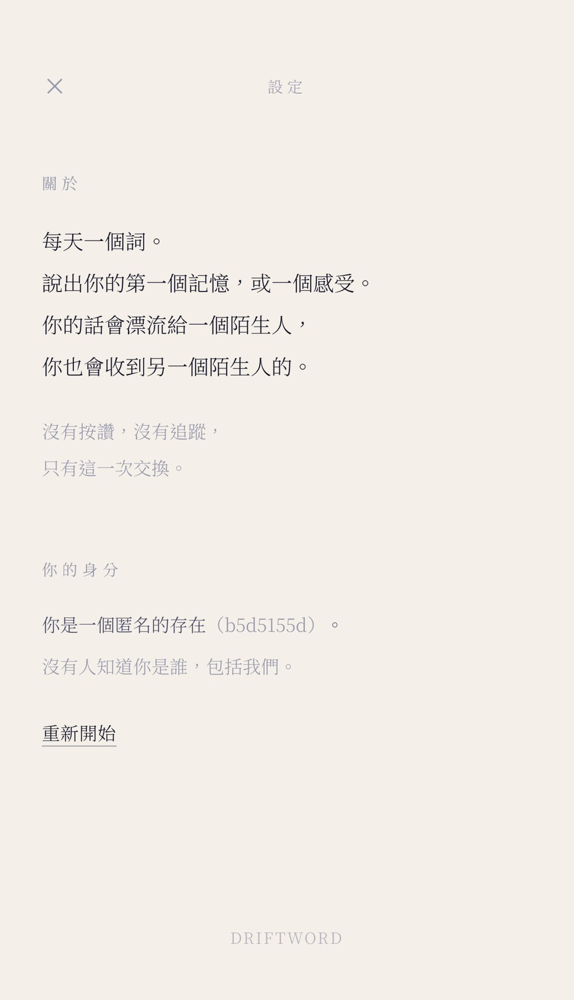

<div align="right">

**English** | [繁體中文](README.zh-TW.md)

</div>

# DriftWord 漂流詞

> One word a day. Speak your first memory of it, or how it makes you feel.
> Your words drift to a stranger, and a stranger's response drifts back to you.
> No likes, no following — just this one exchange.

---

## ▶ Get Started

### 🌊 [https://drift-word.vercel.app](https://drift-word.vercel.app)

Open the page → see today's word → respond by voice or text → receive a letter from a stranger.
No sign-up, no account required.

---

## What Is This

DriftWord is not a social app. It is a **ritual**.

- **One word per day** (e.g. "disappear", "waiting", "last will"), rotated automatically at 00:00 from a 300-word bank.
- You respond with **voice** (up to 3 clips, 60 seconds each) or **text**, sharing your first memory of the word or how it makes you feel.
- Once you send it, your response **drifts to a stranger** — and you **receive another stranger's** response to the same word.
- **Only one exchange per day.** No likes, no replies, no following — you will never meet again.

The moment a response arrives, it feels like opening a letter from nowhere.

---

## Screenshots

<table align="center">
  <tr>
    <td align="center"></td>
    <td align="center"></td>
  </tr>
  <tr>
    <td align="center"></td>
    <td align="center"></td>
  </tr>
  <tr>
    <td align="center"></td>
    <td align="center"></td>
  </tr>
</table>

---

## Features

- 🎙 **Voice responses**: native in-browser recording, up to 3 clips of 60 seconds each, with per-clip playback and re-recording
- ✍️ **Text responses**: a writing page with a handwritten feel
- 🔁 **Drift matching**: sending your response instantly pairs you with a stranger; if no one is available yet, the page quietly waits and a letter surfaces automatically when one drifts in — no refresh needed
- 📨 **Letter-opening experience**: voice plays back as a waveform, text is rendered on handwritten letter paper, and no personal information about the other person is ever shown
- 📅 **Daily word rotation**: word bank + Postgres cron, rotating automatically at 00:00 Taipei time every day
- 🙈 **No registration**: anonymous identity, one exchange per day (enforced at the database level)
- 🛡️ **Content moderation**: text passes through a keyword blocklist plus OpenAI Moderation; voice is transcribed by Groq Whisper and moderated the same way, with API keys never exposed to the frontend

---

## Tech Stack

| Layer | Technology |
|----|------|
| Frontend | React + Vite + Tailwind CSS |
| Backend | Supabase (anonymous Auth / Postgres / Storage) |
| Voice | Native browser MediaRecorder API |
| Scheduling | Supabase pg_cron (daily word rotation) |
| Content moderation | OpenAI Moderation (text) + Groq Whisper (speech-to-text) |
| Deployment | Vercel |

---

## Local Development

```bash
# 1. Get the code
git clone https://github.com/frankkn/DriftWord.git
cd DriftWord

# 2. Install dependencies
npm install

# 3. Configure environment variables
cp .env.example .env.local
# Edit .env.local and fill in your Supabase project URL and publishable key

# 4. Start
npm run dev
# Open http://localhost:5173
```

### Environment Variables

| Variable | Description |
|------|------|
| `VITE_SUPABASE_URL` | Supabase project URL (e.g. `https://xxxx.supabase.co`) |
| `VITE_SUPABASE_KEY` | Supabase publishable key (safe to expose in the frontend) |

---

## Supabase Setup

Run the SQL files under `supabase/` in the Supabase dashboard, in order:

1. **`schema.sql`** — creates the `word_bank` / `drifts` / `drift_segments` tables, RLS policies, the matching RPC, and unique constraints
2. **`words.sql`** — seeds the 300 words, the daily rotation function, and the pg_cron schedule
3. **`storage.sql`** — creates the private `drifts` bucket with its upload/read policies

Also, go to **Authentication → Sign In / Providers** and enable **Anonymous sign-ins**.

### Edge Functions

Under **Edge Functions → Secrets**, add these two secrets:

| Secret | Description |
|--------|------|
| `OPENAI_API_KEY` | OpenAI API key, used for moderating both text and voice |
| `GROQ_API_KEY` | Groq API key, used for speech-to-text (Whisper Large v3 Turbo) |

Deploy the two functions:

```bash
npx supabase functions deploy moderate-text --project-ref <your-project-ref>
npx supabase functions deploy moderate-voice --project-ref <your-project-ref>
```

Alternatively, create them manually in the Supabase Dashboard → Edge Functions and paste in the corresponding code from `supabase/functions/`.

---

## Test Data

To test "receiving a stranger's response" locally, the database needs unclaimed responses left by others:

```bash
node scripts/seed-test-drifts.mjs           # seed 5 text + 1 voice responses
node scripts/seed-test-drifts.mjs 8         # custom count
node scripts/seed-test-drifts.mjs --verify  # claim one after seeding to verify the full loop
```

---

## Project Structure

```
src/
  App.jsx                  Home page and state flow
  components/
    RecordingScreen.jsx    Voice recording screen
    TextScreen.jsx         Text writing screen
    ReceivedScreen.jsx     Letter-opening receiving screen
    LetterAudio.jsx        Waveform audio player
    TodayClosed.jsx        Home state after today's exchange
    SettingsScreen.jsx     Settings screen
    ConfirmDrift.jsx       Confirmation layer before sending
  hooks/
    useRecorder.js         MediaRecorder recording logic
  lib/
    supabase.js            Supabase client
    session.js             Anonymous identity
    words.js               Today's word
    drift.js               Sending, matching, receiving, auto-polling while waiting
    messages.js            Poetic error copy
supabase/
  schema.sql / words.sql / storage.sql
  functions/
    moderate-text/           Text moderation (OpenAI Moderation)
    moderate-voice/          Speech-to-text + moderation (Groq Whisper + OpenAI)
scripts/
  seed-test-drifts.mjs     Test data seeder
```

---

## Design

A paper-like off-white background, ink-dark text, and a restrained dark blue-violet accent. Chinese body text is set in Noto Serif TC, with handwritten letters in Ma Shan Zheng. Minimal, immersive, and a little poetic — so every exchange feels like opening the same page of a shared diary.
